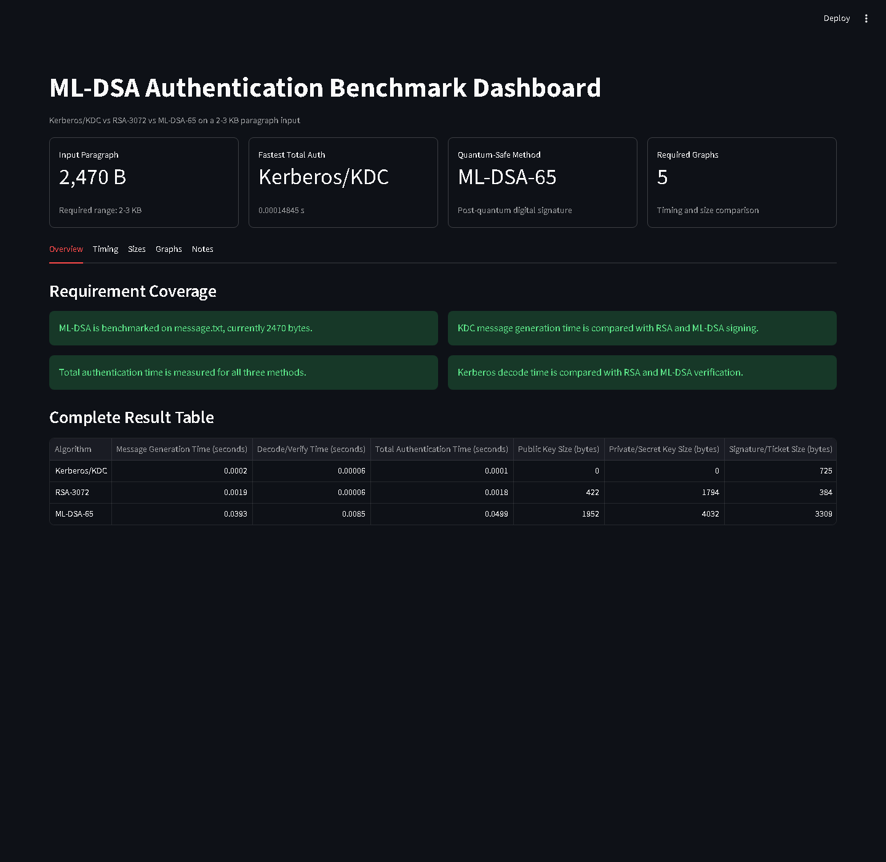
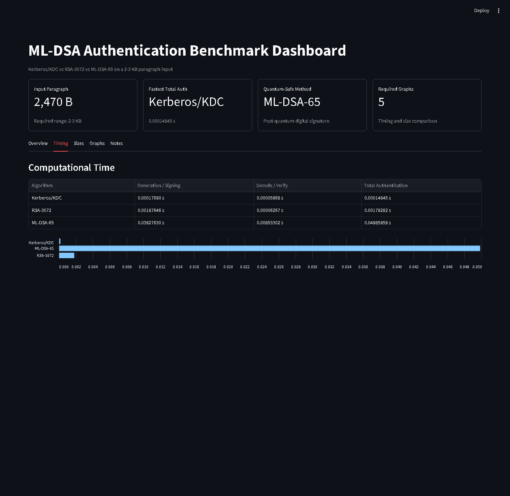
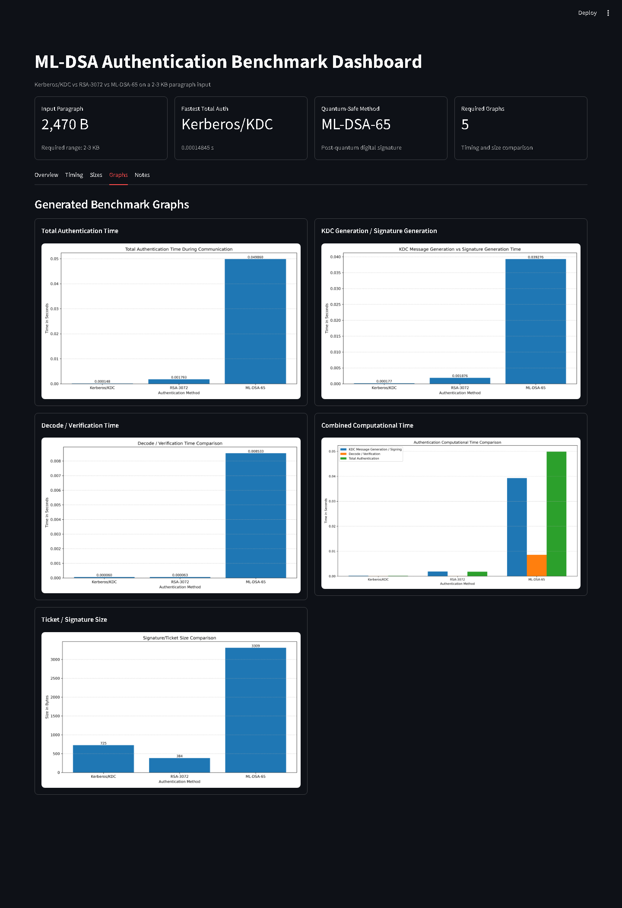
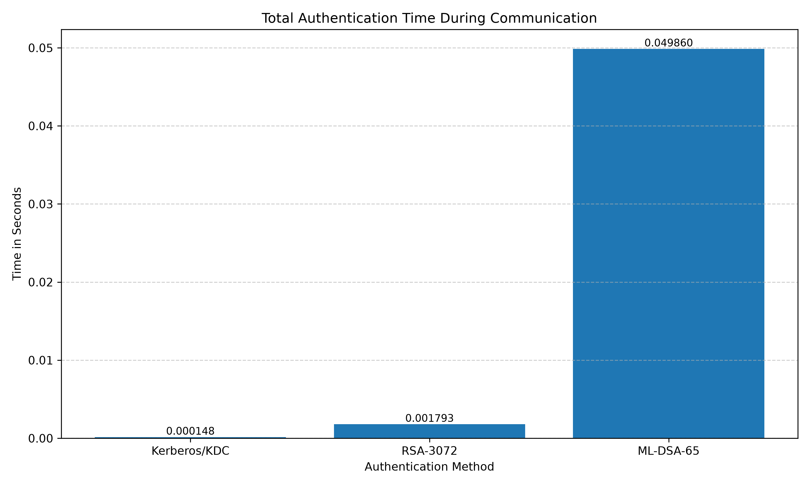
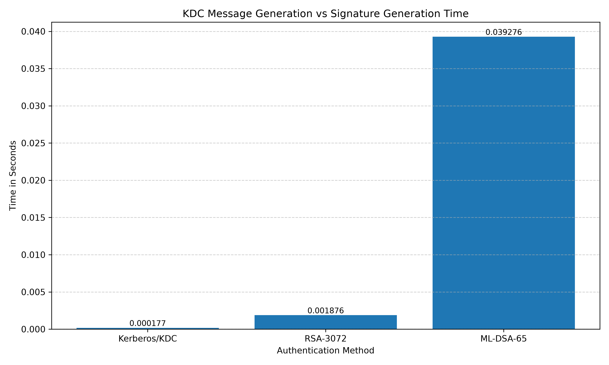
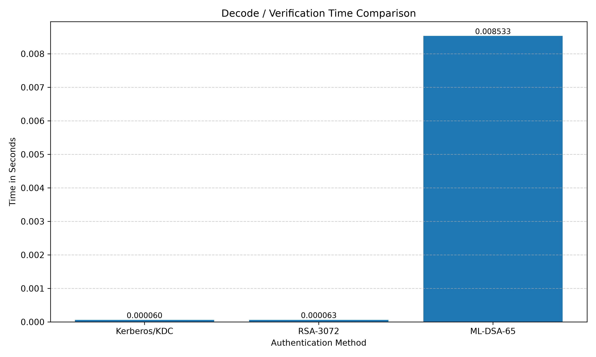
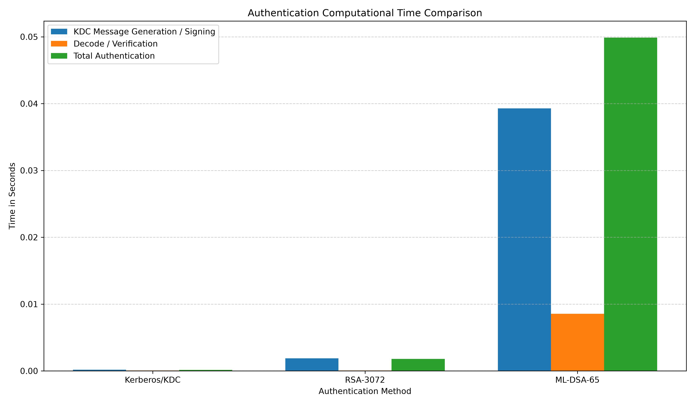
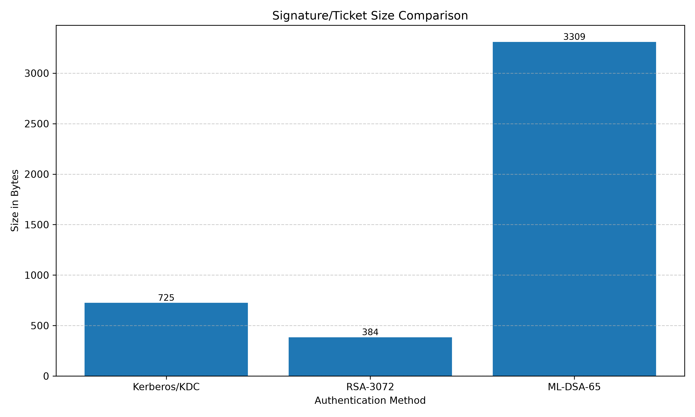

# Post-Quantum Authentication Benchmark


## Overview

This project benchmarks authentication performance for **Kerberos/KDC**, **RSA-3072**, and **ML-DSA-65** on a 2-3 KB paragraph input. It measures authentication cost from multiple practical angles: total authentication time, KDC/signature generation time, decode/verification time, ticket/signature size, key sizes, and quantum-safe status.

The project also generates comparison graphs and provides an interactive **Streamlit dashboard** for visual analysis.

## Why This Project Matters

Traditional authentication systems were designed for classical computing environments. With the progress of quantum computing, widely used public-key schemes such as RSA are expected to become vulnerable to large-scale quantum attacks. This project demonstrates how a post-quantum digital signature algorithm, **ML-DSA**, compares with traditional authentication approaches in terms of computation time, size overhead, and security posture.

This makes the project useful for:

- Academic comparison of classical and post-quantum authentication methods
- Cloud and VM migration security demonstrations
- Understanding performance tradeoffs in post-quantum cryptography
- Evaluating the practical cost of quantum-safe authentication

## Key Features

- Benchmarks **Kerberos/KDC**, **RSA-3072**, and **ML-DSA-65**
- Uses a real 2-3 KB paragraph input from `message.txt`
- Measures total authentication time during communication
- Measures KDC message generation time and signature generation time
- Measures Kerberos decode time and RSA/ML-DSA verification time
- Compares public key, private/secret key, and ticket/signature sizes
- Marks each method as quantum-safe or not quantum-safe
- Generates publication-ready graph PNG files
- Includes an interactive Streamlit dashboard
- Separates each authentication implementation into its own module
- Avoids committing private keys, generated signatures, cache files, or temporary artifacts

## Technologies Used

- **Python** for implementation and benchmarking
- **cryptography** for RSA-3072 and Fernet-based Kerberos/KDC simulation
- **dilithium-py** for ML-DSA-65 digital signatures
- **matplotlib** for graph generation
- **Streamlit** for dashboard visualization
- **CSV** for benchmark result storage

## Project Architecture

```text
crystals_dilithium_project/
|-- authentication_benchmark.py              # Main benchmark runner and graph generator
|-- kerberos_authentication.py               # Kerberos/KDC simulation logic
|-- rsa_signature.py                         # RSA-3072 key, sign, verify, and auth flow
|-- mldsa_signature.py                       # ML-DSA-65 key, sign, verify, and auth flow
|-- streamlit_app.py                         # Interactive Streamlit dashboard
|-- message.txt                              # 2470-byte paragraph input
|-- authentication_benchmark_results.csv     # Latest benchmark output
|-- requirements.txt                         # Python dependencies
|-- .gitignore                               # GitHub cleanup rules
|-- assets/
|   |-- dashboard-overview.png
|   |-- dashboard-timing.png
|   `-- dashboard-graphs.png
`-- graphs/
    |-- total_authentication_time_comparison.png
    |-- message_generation_time_comparison.png
    |-- decode_verification_time_comparison.png
    |-- combined_authentication_time_comparison.png
    `-- signature_ticket_size_comparison.png
```

## Benchmark Metrics Explained

| Metric | Meaning |
|---|---|
| Message Generation Time | Time to generate a Kerberos/KDC message or create a digital signature |
| Decode/Verify Time | Time to decode a Kerberos ticket or verify RSA/ML-DSA signature |
| Total Authentication Time | End-to-end authentication operation time for each method |
| Public Key Size | Size of the public verification key where applicable |
| Private/Secret Key Size | Size of private or secret key material where applicable |
| Signature/Ticket Size | Size of the generated signature or Kerberos ticket message |
| Quantum Safe | Whether the method is resistant to known quantum attacks |

## Installation

1. Clone the repository:

```bash
git clone <your-repository-url>
cd crystals_dilithium_project
```

2. Create and activate a virtual environment:

```bash
python -m venv .venv
.venv\Scripts\activate
```

On macOS/Linux:

```bash
python -m venv .venv
source .venv/bin/activate
```

3. Install dependencies:

```bash
pip install -r requirements.txt
```

## How To Run The Benchmark

Run the main benchmark script:

```bash
python authentication_benchmark.py
```

This will:

- Validate that `message.txt` is between 2 KB and 3 KB
- Run 30 benchmark iterations
- Measure Kerberos/KDC, RSA-3072, and ML-DSA-65 performance
- Save results to `authentication_benchmark_results.csv`
- Regenerate graph images inside `graphs/`

## How To Run The Streamlit Dashboard

Start the dashboard:

```bash
python -m streamlit run streamlit_app.py
```

Then open the local URL shown by Streamlit, usually:

```text
http://localhost:8501
```

## Example Benchmark Results

The following results are from the current `authentication_benchmark_results.csv` file.

| Algorithm | Message Generation / Signing (s) | Decode / Verify (s) | Total Authentication (s) | Public Key (B) | Private / Secret Key (B) | Ticket / Signature (B) | Quantum Safe |
|---|---:|---:|---:|---:|---:|---:|---|
| Kerberos/KDC | 0.00017690 | 0.00005968 | 0.00014845 | 0 | 0 | 725 | No |
| RSA-3072 | 0.00187646 | 0.00006267 | 0.00179282 | 422 | 1794 | 384 | No |
| ML-DSA-65 | 0.03927630 | 0.00853302 | 0.04985959 | 1952 | 4032 | 3309 | Yes |

## Screenshots

### Dashboard Overview



### Timing Results



### Graphs Page



## Graph Results

### Total Authentication Time



### KDC Message Generation vs Signature Generation



### Decode / Verification Time



### Combined Computational Time



### Ticket / Signature Size



## Kerberos vs RSA vs ML-DSA

### Kerberos/KDC

Kerberos is a symmetric-key authentication protocol based on trusted ticket issuance. In this project, Kerberos/KDC is simulated using encrypted KDC messages and service tickets. It is computationally fast because it relies mainly on symmetric cryptographic operations. However, Kerberos by itself is not a post-quantum digital signature scheme.

### RSA-3072

RSA-3072 is a traditional public-key digital signature baseline. It provides authentication and integrity under classical security assumptions, but it is vulnerable to sufficiently powerful quantum computers using Shor's algorithm. In this benchmark, RSA has low verification time and small signature size compared with ML-DSA.

### ML-DSA-65

ML-DSA, formerly associated with CRYSTALS-Dilithium, is a NIST-standardized post-quantum digital signature algorithm. ML-DSA-65 provides quantum-resistant authentication and integrity, but it has larger keys/signatures and higher computational cost compared with RSA and symmetric Kerberos-style authentication.

## Why ML-DSA Is Important For Post-Quantum Security

Quantum computers threaten many classical public-key algorithms. RSA security depends on the difficulty of integer factorization, which can be broken by a sufficiently capable quantum computer. ML-DSA is based on lattice problems that are believed to resist both classical and quantum attacks.

For future cloud systems, secure VM migration, distributed authentication, and long-term digital trust, post-quantum signatures such as ML-DSA are important because they provide a migration path away from quantum-vulnerable public-key authentication.

## Limitations

- The Kerberos/KDC implementation is a simulation for benchmarking, not a full production Kerberos server.
- The benchmark runs locally, so results depend on machine hardware, operating system, Python runtime, and installed libraries.
- The ML-DSA implementation uses an educational Python library and should not be treated as a production cryptographic deployment.
- Network latency is not included; the benchmark focuses on computational authentication cost.
- Timing values may vary slightly between runs.

## Future Improvements

- Add real network communication latency measurements
- Benchmark additional ML-DSA security levels
- Compare with ECDSA, Ed25519, and other post-quantum algorithms
- Add confidence intervals and standard deviation across benchmark runs
- Export a PDF benchmark report automatically
- Add command-line arguments for iteration count and input file path
- Add CI tests for benchmark output schema and dashboard loading

## Author

**RajKaushal**

This project was prepared as an academic and technical demonstration of post-quantum authentication benchmarking.
